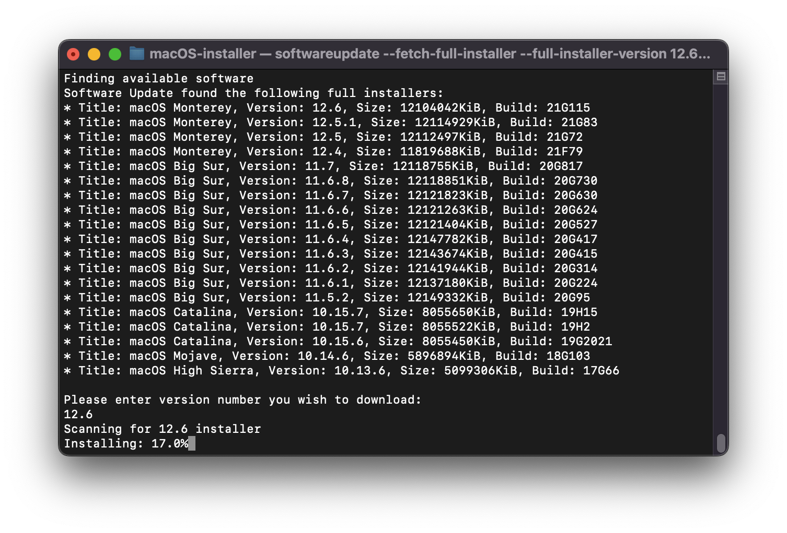

# 在macOS中制作安装程序

虽然你不需要重新安装macOS来使用OpenCore，但一些用户更喜欢使用全新的引导管理器升级。

首先，我们要找一个macOS的副本。如果你只是制作一个可引导的OpenCore U盘，而不是安装程序，你可以跳过这一步，直接格式化USB。对于其他人来说，你可以从App Store下载macOS，也可以使用Munki的脚本。

## 下载macOS:现代OS


此方法允许您下载macOS 10.13及更新版本，对于10.12及更早版本，请参阅[下载macOS: Legacy OS](#downloading-macos-legacy-os).

* **macOS 12及以上版本注意**:由于最新版本的macOS对USB栈进行了更改，因此强烈建议您在安装macOS之前(使用USBToolBox)映射您的USB端口。
  * <span style="color:red"> 注意: </span> 在macOS 11.3及更新版本中，[XhciPortLimit被打破导致启动循环](https://github.com/dortania/bugtracker/issues/162).
    * 如果你已经[映射了你的USB端口](https://sumingyd.github.io/OpenCore-Post-Install/usb/)并且禁用了`XhciPortLimit`，你可以正常启动macOS 11.3+。

从一台符合版本要求的macOS机器上，直接进入App Store:

* [Using App Store](#using-app-store)

对于需要特定操作系统版本或无法从App Store下载的机器:

* [Command Line Software Update Utility,](#command-line-software-update-utility)
* [Munki's InstallInstallMacOS utility](#munkis-installinstallmacos-utility)

## 使用App Store

在符合你想要安装的操作系统版本要求的macOS机器上，直接进入App Store下载所需的操作系统版本，然后继续 [**设置安装程序**](#setting-up-the-installer).


## 命令行软件更新实用程序

打开一个终端窗口，然后复制并粘贴下面的命令:

```sh
softwareupdate --list-full-installers;echo;echo "Please enter version number you wish to download:";read;$(if [ -n "$REPLY" ]; then; echo "softwareupdate --fetch-full-installer --full-installer-version "$REPLY; fi);
```



这为您提供了一个可供选择的可用版本列表。
一旦下载，它将保存在您的应用程序文件夹。
您可以继续执行[**设置安装程序**](#setting-up-the-installer).

## Munki的InstallInstallMacOS实用程序


::: details 运行macOS Monterey 12.3或以上版本的用户请注意

从macOS Monterey 12.3开始，苹果删除了对`python2.7`的支持， 因此如果没有它，`installinstallmacos.py`将出现以下错误:

```
This tool requires the Python xattr module. Perhaps run 'pip install xattr' to install it.
```

为了解决这个问题，我们建议通过在终端中运行`Xcode -select——install`来安装`Xcode命令行工具`，然后运行`pip3 install xattr`

之后你可以使用`python3`而不是`python`来运行下面相同的命令:

```sh
mkdir -p ~/macOS-installer && cd ~/macOS-installer && curl https://raw.githubusercontent.com/munki/macadmin-scripts/main/installinstallmacos.py > installinstallmacos.py && sudo python3 installinstallmacos.py
```
  
:::

为了运行它，只需要在终端窗口中复制并粘贴下面的命令:

```sh
mkdir -p ~/macOS-installer && cd ~/macOS-installer && curl https://raw.githubusercontent.com/munki/macadmin-scripts/main/installinstallmacos.py > installinstallmacos.py && sudo python installinstallmacos.py
```


如你所见，我们得到了一个很好的macOS安装程序列表。如果你需要某个特定版本的macOS，可以通过在它旁边输入数字来选择它。在这个例子中，我们选择10:


这需要一段时间，因为我们正在下载整个8GB以上的macOS安装程序，所以强烈建议你在等待的时候阅读本指南的其余部分。

完成后，你会发现在你的`~/macOS-Installer/`文件夹中有一个包含macOS安装程序的DMG，名为`Install_macOS_11.1-20C69.Dmg`。挂载它，你就会找到安装程序。

* 注意:我们建议移动安装 macOS.app 到 `/Applications` 文件夹，因为我们将从那里执行命令。
* 注意 2:在Finder中运行Cmd+Shift+G可以让你轻松跳转到`~/macOS-installer`


从这里，跳转到[设置安装程序](#setting-up-the-installer) 来完成你的工作。如果你想检查下载的完整性，你可以检查[这个校验存储库](https://github.com/notpeter/apple-installer-checksums), 不过请注意，这些校验和是众包的，可能不是检查真实性的可靠方法。

## 下载macOS:传统OS

* 此方法允许您下载OS X的更老版本，目前支持所有OS X的英特尔版本(10.4到当前)

  * [传统macOS:离线方法](./mac-install-pkg.md)
    * 10.7 - 10.12 支持，不包括 10.9
  * [传统macOS:在线方法](./mac-install-recovery.md)
    * 10.7 - 11 支持
  * [传统macOS:磁盘映像](./mac-install-dmg.md)
    * 10.4 - 10.6 支持

## 设置安装程序

现在我们将格式化USB为macOS安装程序和OpenCore做准备。我们希望使用带有GUID分区映射的macOS Extended (HFS+)。这将创建两个分区:主分区`MyVolume`和第二个名为`EFI`的分区，它用作引导分区，固件将在其中检查引导文件。

* 注意1:通过格式化USB创建的`EFI`分区是隐藏的，直到你挂载它。稍后将在[设置OpenCore的EFI环境](#setting-up-opencores-efi-environment)时挂载
* 注2:默认情况下，磁盘工具只显示分区-按Cmd/Win+2显示所有设备(或者你可以按查看按钮)
* 注3:“Legacy macOS: 在线方法”部分的用户可以跳转到[设置OpenCore的EFI环境](#setting-up-opencores-efi-environment)


接下来运行[苹果](https://support.apple.com/en-us/HT201372)提供的`createinstallmedia`命令。请注意，该命令是为名称为`MyVolume`的USB创建的:

```sh
sudo /Applications/Install\ macOS\ Big\ Sur.app/Contents/Resources/createinstallmedia --volume /Volumes/MyVolume
```

::: details Apple Silicon上安装macOS比Big Sur更早的用户请注意

如果`createinstallmedia`以`zsh:killed`或`killed:9`失败，那么很可能是安装程序的代码签名有问题。要解决这个问题，您可以运行以下命令:

```sh
cd /Applications/Install\ macOS\ Big\ Sur.app/Contents/Resources/
codesign -s - -f --deep /Applications/Install\ macOS\ Big\ Sur.app
```

你需要为Xcode安装命令行工具:

```sh
xcode-select --install
```

:::

这需要一些时间，所以你可能想要喝杯咖啡或继续阅读本指南(公平地说，你真的不应该在没有阅读完整内容之前一步一步地遵循本指南)。

你也可以将`createinstallmedia`路径替换为安装程序所在的路径(与驱动器名称相同)。

::: details 传统 createinstallmedia 命令

来自苹果自己的网站:[如何为macOS创建一个可引导安装程序](https://support.apple.com/en-us/HT201372)

```sh
# Ventura
sudo /Applications/Install\ macOS\ Ventura.app/Contents/Resources/createinstallmedia --volume /Volumes/MyVolume

# Monterey
sudo /Applications/Install\ macOS\ Monterey.app/Contents/Resources/createinstallmedia --volume /Volumes/MyVolume

# Big Sur
sudo /Applications/Install\ macOS\ Big\ Sur.app/Contents/Resources/createinstallmedia --volume /Volumes/MyVolume

# Catalina
sudo /Applications/Install\ macOS\ Catalina.app/Contents/Resources/createinstallmedia --volume /Volumes/MyVolume

# Mojave
sudo /Applications/Install\ macOS\ Mojave.app/Contents/Resources/createinstallmedia --volume /Volumes/MyVolume

# High Sierra
sudo /Applications/Install\ macOS\ High\ Sierra.app/Contents/Resources/createinstallmedia --volume /Volumes/MyVolume

# Sierra
sudo /Applications/Install\ macOS\ Sierra.app/Contents/Resources/createinstallmedia --volume /Volumes/MyVolume --applicationpath /Applications/Install\ macOS\ Sierra.app

# El Capitan
sudo /Applications/Install\ OS\ X\ El\ Capitan.app/Contents/Resources/createinstallmedia --volume /Volumes/MyVolume --applicationpath /Applications/Install\ OS\ X\ El\ Capitan.app

# Yosemite
sudo /Applications/Install\ OS\ X\ Yosemite.app/Contents/Resources/createinstallmedia --volume /Volumes/MyVolume --applicationpath /Applications/Install\ OS\ X\ Yosemite.app

# Mavericks
sudo /Applications/Install\ OS\ X\ Mavericks.app/Contents/Resources/createinstallmedia --volume /Volumes/MyVolume --applicationpath /Applications/Install\ OS\ X\ Mavericks.app --nointeraction
```

:::

## 传统设置

对于不支持UEFI引导的系统，请参见以下内容:

::: details 设置传统引导

首先，你需要以下文件:

* BootInstall_IA32.tool 或 BootInstall_X64.tool
  * 可以在OpenCorePkg的`/utilities/LegacyBoot/`目录下找到
* 安装USB(上面创建的)

在你的OpenCore build文件夹中，导航到`Utilities/LegacyBoot`。在这里你会找到一个名为`BootInstall_ARCH.tool`的文件。这样做的目的是将DuetPkg安装到所需的驱动器。


现在**使用sudo**在终端中运行此工具(否则此工具可能会失败):

```sh
# Replace X64 with IA32 if you have a 32-Bit CPU
sudo ~/Downloads/OpenCore/Utilities/legacyBoot/BootInstall_X64.tool
```


这将给您一个可用磁盘的列表，选择您的磁盘，并提示您写入一个新的MBR。选择yes`[y]`，你就完成了。


这将为你提供一个包含**bootia32**或**bootx64**文件的EFI分区

:::

## 设置OpenCore的EFI环境

设置OpenCore的EFI环境很简单-你需要做的就是挂载我们的EFI系统分区。当我们使用GUID格式化时，这是自动生成的，但默认情况下是卸载的， 这就是我们的朋友[挂载EFI](https://github.com/corpnewt/MountEFI) 发挥作用的地方:


你会注意到，打开EFI分区后，它是空的。这就是乐趣的开始。


## 现在所有这些都完成了，前往[设置EFI](./opencore-efi.md) 来完成你的工作
